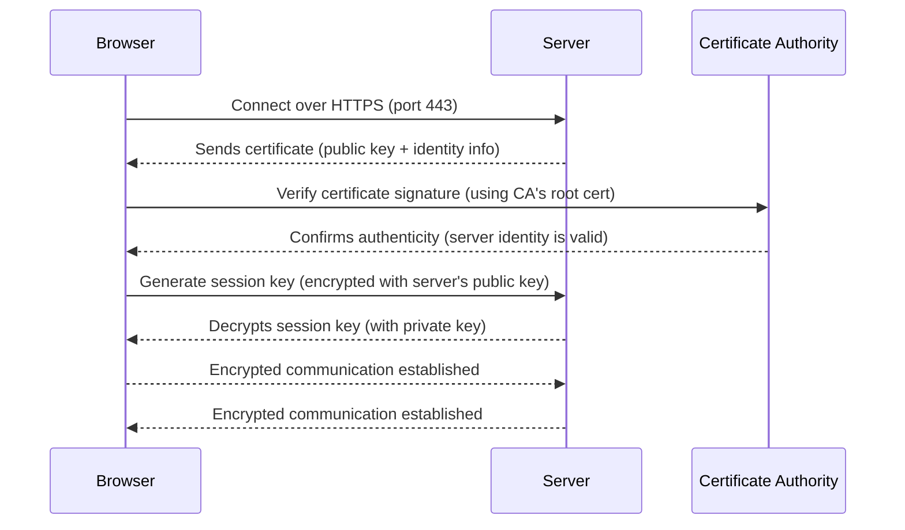

secure [[http]], internet traffic can be intercepted so we must encrypt it using [[certificates]]

### diagram

```mermaid
sequenceDiagram

participant Browser

participant Server

participant CA as Certificate Authority

  

Browser->>Server: Connect over HTTPS (port 443)

Server-->>Browser: Sends certificate (public key + identity info)

Browser->>CA: Verify certificate signature (using CA's root cert)

CA-->>Browser: Confirms authenticity (server identity is valid)

Browser->>Server: Generate session key (encrypted with server's public key)

Server-->>Browser: Decrypts session key (with private key)

Browser-->>Server: Encrypted communication established

Server-->>Browser: Encrypted communication established
```