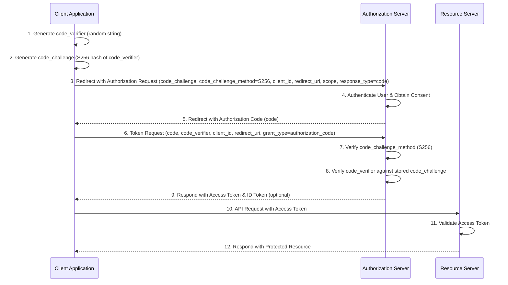

#infra/auth 
proof key for code exchange (pixie)

secure auth for apps without the ability to store secrets (backendless clients) 

### why
when authorizing clients, we cannot securely store secrets. any client could replicate the oauth flow and gain a token for our app. this is what pkce prevents.

if the flow is intercepted at the auth server step, there is no way of mocking here (since we don't know the client original secret, only the hash)

### how
we generate some secret and hash it, which is exchanged for a code on the auth server associated with that hash. the client can exchange that code with the secret (prehash) for an access token.

the auth server will hash the secret, and cross reference it with the hash you gave it in the original exchange for the code to verify that you are the same requester. 

### steps
1. create secret string
2. hash secret string
3. redirect to auth server, sending hash
4. user completes oauth flow
5. auth server redirects to app, with a code
6. app exchanges code and original secret for tokens

[^1]: [OAuth is Broken Without This \| Meet PKCE - YouTube](https://www.youtube.com/watch?v=5FrA0UzV1Aw)
[^2]: [PKCE for OAuth 2.0](https://oauth.net/2/pkce/)